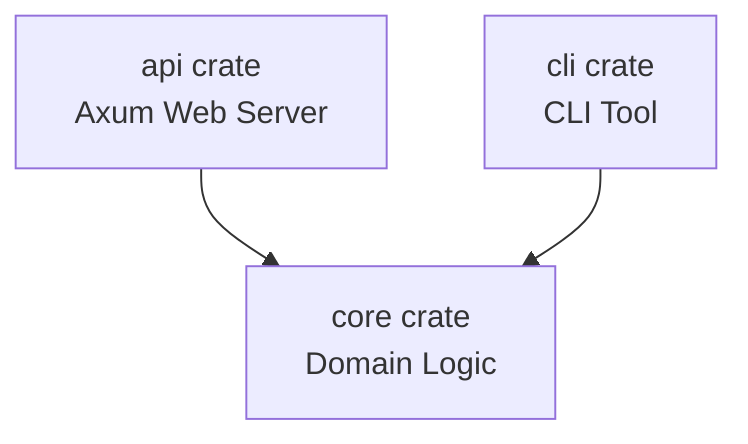

# Spritz

A production-ready Rust application structured as a modular workspace.

## Architecture

This project is separated into three crates:
- `core`: Pure domain logic and models.
- `api`: External interface using Axum web framework.
- `cli`: Command-line interface.

## Getting Started

Run `cargo build` and `cargo test` from the root of the workspace.
